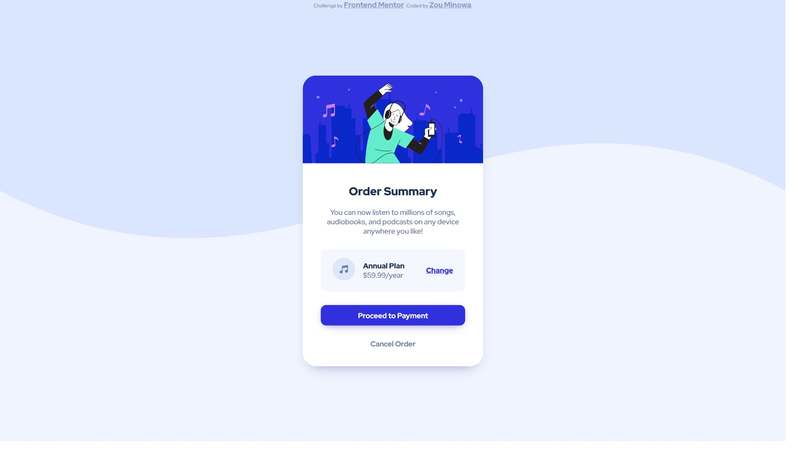

# Frontend Mentor - Order summary card solution

This is a solution to the [Order summary card challenge on Frontend Mentor](https://www.frontendmentor.io/challenges/order-summary-component-QlPmajDUj).

## Table of contents

- [Overview](#overview)
  - [The challenge](#the-challenge)
  - [Screenshot](#screenshot)
  - [Links](#links)
- [My process](#my-process)
  - [Built with](#built-with)
  - [What I learned](#what-i-learned)
  - [Continued development](#continued-development)
  - [Useful resources](#useful-resources)
- [Author](#author)

**Note: Delete this note and update the table of contents based on what sections you keep.**

## Overview

### The challenge

Users should be able to:

- See hover states for interactive elements

### Screenshot

### Links

- Solution URL: [https://github.com/Zomino/fm-order-summary-component](https://github.com/Zomino/fm-order-summary-component)
- Live Site URL: [https://zomino.github.io/fm-order-summary-component/](https://zomino.github.io/fm-order-summary-component/)

## My process

### Built with

- HTML5
- CSS
- Flexbox

### What I learned

- Topics explored
  - CSS variables
  - Images/SVGs as backgrounds
  - Flexbox
  - Psuedo-elements
  - Box-shadow property
  - Media-queries
  - Substring matching attribute selectors
  - Git push
  - Git reset
  - Github Pages
  - README files
  - Markdown
  - Chrome Dev Tools
- Other takeaways
  - Try to write HTML first.
  - CSS pixels are different from device pixels.
  - Clean up commits (if required) before pushing to upstream.
  - Use Chrome Dev Tools to modify CSS in-browser.
  - Flexbox is useful for arranging elements horizontally.
  - A grey cancel button is harder to see!
  - For buttons that just consist of text, limit the area triggering the hover effect to just the text itself.
  - Avoid only using divs, as this hurts the accessibility of a page.
  - The semantic tags used should depend on the scope of the project. For example, if the page only consists of a card, then that card heading should take the h1 tag.

### Continued development

- Improvement ideas for next time
  - Design as mobile first.
- Things to work on
  - HTML semantics
  - Flexbox
  - Psuedo-elements
  - Determining when to use class vs id in CSS

### Useful resources

- [A Complete Guide to Flexbox](https://css-tricks.com/snippets/css/a-guide-to-flexbox/) - This helped me to visualise the effect of Flexbox properties.
- [Web Dev Simplified](https://www.youtube.com/c/WebDevSimplified) - This YouTube channel has short, clear tutorials that helped me to understand and visualise CSS topics that I was struggling with.

## Author

- Frontend Mentor - [@Zomino](https://www.frontendmentor.io/profile/Zomino)
